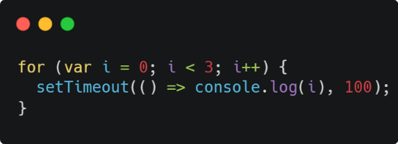

# Bài kiểm tra lập trình tuần 1

## Câu 1

- Cho đoạn code xử lí vòng lặp sau:
  

- Yêu cầu: Nhận định "Đoạn code này sẽ in ra lần lượt các số 0, 1, 2" là đúng hay sai? Nếu sai, hãy giải thích nguyên nhân cốt lõi và viết lại đoạn code bằng kiến thức ES6 để chương trình in ra đúng dãy số 0, 1, 2.

- Trả lời: Nhận định bên trên là đúng

- Khi dùng let khai báo biến lặp, với mỗi vòng lặp Javascript sẽ tạo 1 vùng nhớ riêng cho vòng lặp đó và nhờ cơ chế `closure` của `setTimeout`, `setTimeout` khi register sẽ tham chiếu đến vùng nhớ do vòng lặp tạo ra và cuối cùng sau khi for chạy xong, các `setTimeout` được register sẽ lần lượt in 0, 1, 2
- Nhưng nếu dùng var khai báo biến lặp, với mỗi vòng lặp Javascript chỉ tạo 1 vùng nhớ duy nhất cho biến i xuyên suốt vòng for nên sau khi for kết thúc cả 3 set `setTimeout` register tham chiếu đến vùng nhớ duy nhất nên in ra 3
